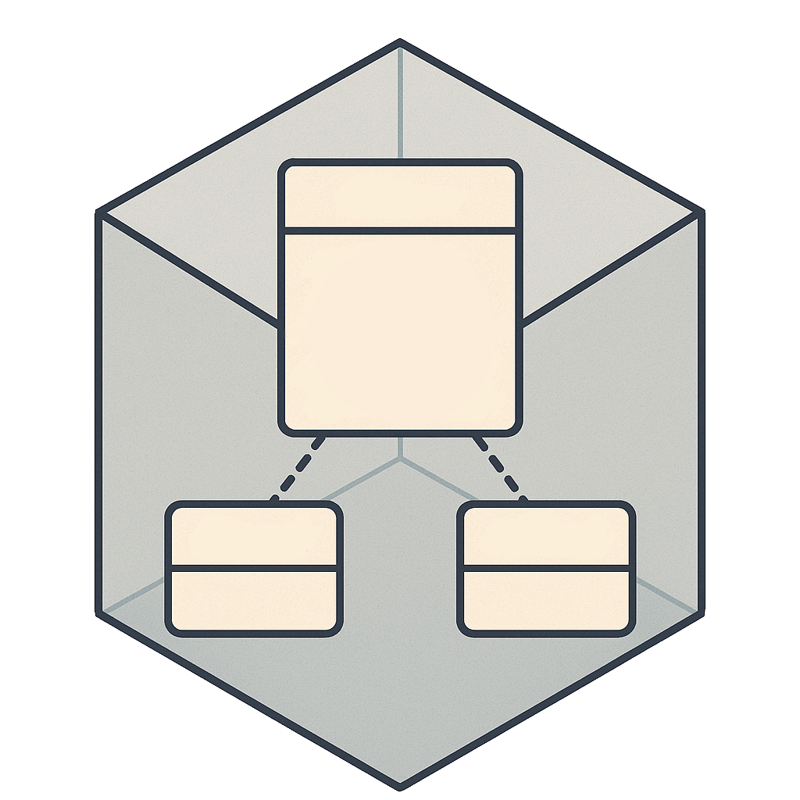
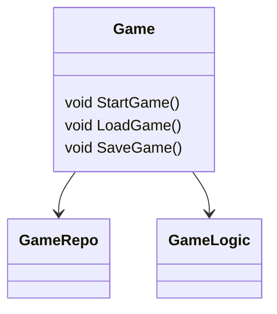

# 🧩 UMLGenerator

[![Chickensoft Badge][chickensoft-badge]][chickensoft-website] [![Discord][discord-badge]][discord] ![line coverage][line-coverage] ![branch coverage][branch-coverage]

A tool for generating UML diagrams from C# code, designed to work seamlessly with Godot and .NET projects. UMLGenerator simplifies visualizing complex class hierarchies, and relationships through automated diagram creation.

---

<p align="center">

</p>

---

## 📌 Overview

UMLGenerator produces PlantUML `.puml` files from your codebase, enabling easy visualization of:
- Class inheritance trees
- Component relationships
- Method call dependencies

The generated diagrams are placed alongside source files with the `*.g.puml` extension, ready for rendering with [PlantUML], [VSCode extension], or the [Jetbrains plugin].

## 🧰 Key Features

- **Automatic diagram generation** from tscn and C# code
- **Integration with Godot.NET projects**
- **Real-time visualization** via IDE plugins

## 🧪 Example
```csharp
using Chickensoft.UMLGenerator
    
public interface IGame
{
    void StartGame();
    void LoadGame();
    void SaveGame();
}
    
[ClassDiagram(UseVSCodePaths = true)] 
public class Game : Node, IGame 
{
	public IGameRepo GameRepo { get; set; } = null!;
	public IGameLogic GameLogic { get; set; } = null!;
    
    // ... (implementation details) 
}
``` 

This would generate a PlantUML file showing:
- Class relationships
- Interface implementations
- Method signatures

## 🖼️ Visualizing UML Diagrams

Generated `.puml` files can be visualized using PlantUML. For example:



## 📚 Getting Started

1. Install the UMLGenerator package
2. Add `<AdditionalFiles Include="**/*.tscn"/>` so that all .tscn files within the project directory are found (may want to exclude addons)
3. Add `[ClassDiagram(UseVSCodePaths = true)]` attribute to classes. 
    1. If you use Jetbrains Rider, either remove UseVSCodePaths, or set it to false
4. Build your project
5. Open the generated `.g.puml` files

[chickensoft-badge]: https://chickensoft.games/img/badges/chickensoft_badge.svg
[chickensoft-website]: https://chickensoft.games
[discord-badge]: https://chickensoft.games/img/badges/discord_badge.svg
[discord]: https://discord.gg/gSjaPgMmYW
[branch-coverage]: Chickensoft.LogicBlocks.Tests/badges/branch_coverage.svg
[line-coverage]: Chickensoft.LogicBlocks.Tests/badges/line_coverage.svg

[VSCode Extension]: https://marketplace.visualstudio.com/items?itemName=jebbs.plantuml
[Jetbrains plugin]: https://marketplace.visualstudio.com/items?itemName=jebbs.plantuml
[PlantUML]: https://plantuml.com/

